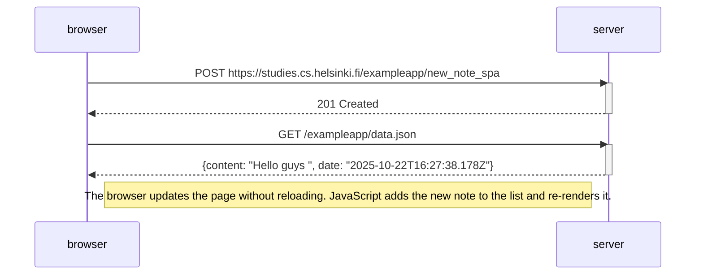

# MY DIAGRAMA

```mermaid
sequenceDiagram
    participant browser
    participant server

    browser->>server: POST https://studies.cs.helsinki.fi/exampleapp/new_note_spa
    activate server
    server-->>browser: 201 Created
    deactivate server

    browser->>server: GET /exampleapp/data.json
    activate server
    server-->>browser: {content: "Hello guys ", date: "2025-10-22T16:27:38.178Z"}
    deactivate server

    Note right of browser: The browser updates the page without reloading. JavaScript adds the new note to the list and re-renders it.
```

